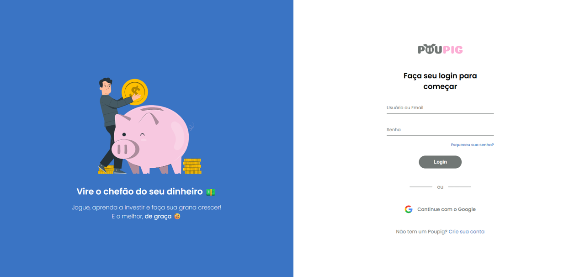

  
  [![Contributors][contributors-shield]][contributors-url]
  [![Forks][forks-shield]][forks-url]
  [![Stargazers][stars-shield]][stars-url]
  [![Issues][issues-shield]][issues-url]
  [![MIT License][license-shield]][license-url]

 

  
  <h3 align="center">meupoupig</h3>
  

    Um aplicativo de educação financeira gratuito e divertido para ensinar jovens a investir.
     
    <a href="https://github.com/voaneves/meupoupig"><strong>Explore a documentação »</strong></a>
     
     
    <a href="https://voaneves.com/meupoupig">Visite o site</a>
    ·
    <a href="https://github.com/voaneves/meupoupig/issues">Reporte um bug</a>
    ·
    <a href="https://github.com/voaneves/meupoupig/issues">Peça uma funcionalidade</a>
  

  
Índice

  <ol>
    <li>
      <a href="#sobre-o-projeto">Sobre o Projeto</a>
      <ul>
        <li><a href="#tecnologias-utilizadas">Tecnologias Utilizadas</a></li>
        <li><a href="#web-app-progressivo-pwa">Web App Progressivo (PWA)</a></li>
        <li><a href="#otimizacao-do-site">Otimização do Site</a></li>
        <li><a href="#gamificacao-na-educacao">Gamificação na Educação</a></li>
        <li><a href="#objetivos-smart">Objetivos SMART</a></li>
      </ul>
    </li>
    <li>
      <a href="#impacto-social-e-educativo">Impacto Social e Educativo</a>
      <ul>
        <li><a href="#educacao-financeira-como-ferramenta-de-empoderamento">Educação Financeira como Ferramenta de Empoderamento</a></li>
        <li><a href="#impacto-alem-da-sala-de-aula">Impacto Além da Sala de Aula</a></li>
        <li><a href="#fomentando-uma-comunidade-engajada">Fomentando uma Comunidade Engajada</a></li>
        <li><a href="#compromisso-com-o-futuro">Compromisso com o Futuro</a></li>
      </ul>
    </li>
    <li><a href="#contribuindo">Contribuindo</a></li>
    <li><a href="#licenca">Licença</a></li>
    <li><a href="#agradecimentos">Agradecimentos</a></li>
  </ol>

## Sobre o Projeto

"Meu Poupig" emerge como uma inovadora plataforma de educação financeira, especificamente concebida para o público jovem do Brasil. Este projeto, fruto do Projeto Aplicado (PA) do Grupo 16 da 2ª turma XP Educação, adota uma abordagem progressiva ao aprendizado financeiro. Através de uma envolvente combinação de quizzes, vídeos, textos e jogos dentro de trilhas de aprendizado cuidadosamente estruturadas, nossa missão é revitalizar o ensino de finanças. Ao torná-lo mais dinâmico, interativo e atraente, almejamos capturar o interesse dos jovens, incentivando sua participação ativa e combatendo o desinteresse e a evasão.

  

O projeto "Meu Poupig" nasceu da visão de superar os obstáculos impostos pela educação financeira tradicional, através do poder transformador da tecnologia da informação. Diante de um cenário onde a educação financeira é frequentemente inacessível ou desinteressante para muitos, especialmente para jovens em situações de vulnerabilidade, "Meu Poupig" busca ser uma ponte para o empoderamento. Proporcionando aos jovens não apenas o conhecimento, mas também as ferramentas práticas necessárias, nosso objetivo é habilitá-los a tomar decisões financeiras sólidas e informadas, estabelecendo as bases para um futuro financeiramente seguro e independente.

### Tecnologias Utilizadas

Desenvolvemos a plataforma usando:

- **HTML**: Estrutura do site.
- **CSS**: Estilização e responsividade.
- **JavaScript**: Interações dinâmicas e lógica de gamificação.

### Web App Progressivo (PWA)

Nossa plataforma é um PWA, garantindo funcionalidade offline e uma experiência de usuário semelhante a aplicativos nativos. Isso permite que os jovens acessem o conteúdo educacional a qualquer momento, potencializando o aprendizado contínuo.

### Otimização do Site

Optimizamos rigorosamente o site para SEO e acessibilidade, alcançando uma pontuação perfeita no Lighthouse. Removemos o Google Analytics para evitar impactos no desempenho, priorizando uma experiência de usuário fluida e rápida.

### Gamificação na Educação

Integramos elementos de jogos para tornar o aprendizado sobre finanças envolvente e divertido. A gamificação é aplicada para reforçar conceitos financeiros chave, incentivando os usuários através de desafios, recompensas e competições.

### Objetivos SMART

Definimos metas claras e mensuráveis para avaliar o sucesso do nosso projeto, incluindo aumentar a conscientização financeira entre os jovens, melhorar os hábitos de criar poupança e investir, e proporcionar um sistema de feedback contínuo para garantir uma taxa de satisfação alta entre os usuários. Utilizamos metodologias SMART para estabelecer objetivos específicos, mensuráveis, alcançáveis, relevantes e com prazo definido, assegurando um impacto significativo e duradouro na educação financeira dos jovens brasileiros.

(<a href="#readme-top">back to top</a>)

## Impacto Social e Educativo

O projeto "Meu Poupig" nasce de um compromisso profundo com a transformação social através da educação financeira. Em um país como o Brasil, onde a literacia financeira ainda é um desafio significativo para muitos jovens, a necessidade de iniciativas inovadoras e acessíveis é premente. "Meu Poupig" busca endereçar essa lacuna, oferecendo uma plataforma gamificada que não apenas educa, mas também engaja e inspira a próxima geração a tomar decisões financeiras conscientes e informadas.

### Educação Financeira como Ferramenta de Empoderamento

Acreditamos firmemente que a educação financeira é uma ferramenta poderosa de empoderamento. Ao equipar jovens com conhecimento sobre gestão de finanças pessoais, economia, investimentos, e poupança, estamos contribuindo para a formação de cidadãos mais preparados para enfrentar desafios econômicos e capazes de construir um futuro mais próspero e estável. "Meu Poupig" coloca esses ensinamentos ao alcance de todos, removendo barreiras e democratizando o acesso à educação financeira de qualidade.

### Impacto Além da Sala de Aula

O impacto de "Meu Poupig" estende-se além da sala de aula. Ao promover uma abordagem interativa e lúdica para o aprendizado financeiro, a plataforma motiva os jovens a aplicarem seus conhecimentos no dia a dia, influenciando positivamente suas famílias e comunidades. Histórias de usuários mostram que, através do jogo, conversas sobre finanças tornaram-se comuns entre amigos e familiares, promovendo uma cultura de planejamento e responsabilidade financeira.

### Fomentando uma Comunidade Engajada

Além de ser uma ferramenta educacional, "Meu Poupig" é uma comunidade vibrante e engajada de jovens aprendizes, educadores, e entusiastas da educação financeira. A plataforma oferece um espaço seguro para discussão, troca de experiências, e suporte mútuo, onde os usuários podem crescer juntos. Estamos comprometidos em continuar desenvolvendo e adaptando "Meu Poupig" para atender às necessidades e feedbacks dessa comunidade, garantindo que nosso impacto seja sustentável e de longo prazo.

### Compromisso com o Futuro

"Meu Poupig" é mais do que um projeto; é um compromisso com o futuro da educação financeira no Brasil. Estamos apenas começando e reconhecemos o longo caminho que temos pela frente. Contudo, cada história de sucesso nos motiva a continuar, cada feedback nos guia para melhorias, e cada parceiro que se junta a nós amplia nosso alcance e impacto. Juntos, estamos construindo uma geração mais informada, responsável e preparada para os desafios financeiros do futuro.

(<a href="#readme-top">back to top</a>)

## Contribuindo

Estamos sempre em busca de colaboradores que possam nos ajudar a expandir e melhorar "Meu Poupig". Seja adicionando novos recursos, melhorando a interface do usuário, ou ajudando na tradução do conteúdo para torná-lo acessível a mais pessoas. Se você está interessado em contribuir para o projeto, veja como pode ajudar:

- **Desenvolvimento**: Contribua com código para novas funcionalidades ou correções de bugs.
- **Design**: Ajude-nos a melhorar a experiência do usuário e o design da interface.
- **Conteúdo**: Colabore na criação de conteúdo educacional financeiro envolvente.
- **Tradução**: Auxilie na tradução do conteúdo para tornar a plataforma acessível a um público mais amplo.

(<a href="#readme-top">back to top</a>)

## Licença

Este projeto está licenciado sob a Licença MIT - veja o arquivo [LICENSE](LICENSE) para mais detalhes. Isso significa que você é livre para usar, copiar, modificar e distribuir o projeto, desde que forneça o devido crédito e não o utilize para fins comerciais sem permissão.

(<a href="#readme-top">back to top</a>)

## Agradecimentos

Um projeto como "Meu Poupig" não seria possível sem o esforço e a dedicação de muitas pessoas. Gostaríamos de agradecer especialmente:

- Grupo 16 da XP Educação: Pela iniciativa e trabalho árduo no desenvolvimento da plataforma.
- Orientador Italo Lucena: Por sua orientação valiosa e suporte contínuo.
- Comunidade de Desenvolvedores e Educadores Financeiros: Por compartilhar conhecimento e recursos que enriquecem nosso conteúdo.
- Usuários: Por nos dar feedback construtivo que nos ajuda a melhorar a cada dia.

E a todos que de alguma forma contribuíram para o sucesso deste projeto. Seu apoio e colaboração são imensamente apreciados.

(<a href="#readme-top">back to top</a>)

[contributors-shield]: https://img.shields.io/github/contributors/voaneves/meupoupig.svg?style=for-the-badge
[contributors-url]: https://github.com/voaneves/meupoupig/graphs/contributors
[forks-shield]: https://img.shields.io/github/forks/voaneves/meupoupig.svg?style=for-the-badge
[forks-url]: https://github.com/voaneves/meupoupig/network/members
[stars-shield]: https://img.shields.io/github/stars/voaneves/meupoupig.svg?style=for-the-badge
[stars-url]: https://github.com/voaneves.com/meupoupig/stargazers
[issues-shield]: https://img.shields.io/github/issues/voaneves/meupoupig.svg?style=for-the-badge
[issues-url]: https://github.com/voaneves/meupoupig/issues
[license-shield]: https://img.shields.io/github/license/voaneves/meupoupig.svg?style=for-the-badge
[license-url]: https://github.com/voaneves/meupoupig/blob/main/LICENSE
